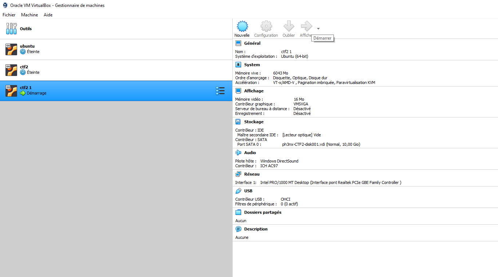

# How To Install .ova Files In VirtualBox

## Click on Import Vm File

## Select Ova file

## Generate New Mac Adress 

## Click on Import

## When The Importation Is Finished Click on Start

## Wait For The Machine To Boot Up

## Check If Your Machine Is On The Network (netdiscover)

## Clear The Room :)
